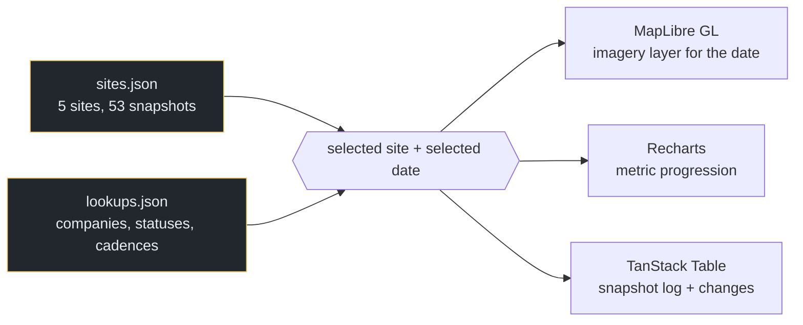

# Satellite Explorer

A time-series viewer for tracking data-centre construction from overhead imagery.
Five sites, 53 dated snapshots, each carrying counted features — buildings,
substations, cooling towers, generators — and a percent-complete estimate, so you
can scrub a site's build from bare pad to energised campus and see what changed
between any two dates. MapLibre GL for the map, Recharts for the progression
curves, TanStack Table for the snapshot log.

Built around the question that makes satellite monitoring useful for
infrastructure: not *what does this site look like*, but *what is different since
last time, and what does the rate of change imply about the delivery date*.


*Placeholder still. The value is in scrubbing between dates — a demo GIF replaces this.*

**Live → [satellite-explorer-seven.vercel.app](https://satellite-explorer-seven.vercel.app/)**

---

## What it tracks

| | |
|---|---|
| Sites | 5 |
| Dated snapshots | 53 |
| Cadence per site | 5–18 snapshots, varying by build tempo |
| Statuses | pre-development · under construction · active |

Each snapshot records:

```jsonc
{
  "date": "2024-06-01",
  "metrics": {
    "estimated_mw":     0,   // derived from counted equipment, not published
    "building_sqft":    0,
    "cooling_towers":   0,
    "generators":       1,
    "percent_complete": 0
  },
  "changes": []              // what moved since the previous snapshot
}
```

**The details that would have made it wrong:**

- **Capacity is inferred from counted equipment, never read off a document.**
  `estimated_mw` is a derivation from generator and substation counts. Labelling
  it `mw` rather than `estimated_mw` would have been the difference between an
  estimate and a claim.
- **Cadence is per site, not global.** A site under active construction earns 18
  snapshots; one still in pre-development gets 5. Forcing a uniform interval would
  either waste imagery on empty fields or undersample the interesting part.
- **`changes` is stored per snapshot rather than recomputed.** Change detection is
  the analytical product; keeping it as data means the viewer displays a finding
  rather than re-deriving one in the browser each time.
- **Percent-complete is a judgement, and it is stored as one.** It is an analyst's
  read of structural progress, not a formula over square footage.

---

## Data provenance

**The dataset in this repository is synthetic.** Site names — Apex Cloud
Solutions, NovaTech Industries, Meridian Digital, Titan Infrastructure, Pinnacle
Systems — are invented, and the imagery layer references are placeholders. The real
version ran against licensed commercial imagery and tracked named sites; neither
can be republished.

What is real here is the schema and the interaction: the snapshot model, the
per-site cadence, the change log, and the way the map, the chart and the table
stay locked to one selected date.

---

## Architecture



The important edge: **the selected date is one value, and all three surfaces
observe it.** Clicking a point on the progression chart moves the map imagery and
the table row together, because none of them owns the date — which is what makes
"compare these two dates" a single interaction rather than three.

---

## Quickstart

```bash
npm install
npm run dev
```

```bash
npm run build
```

Static build. No API keys, no imagery credentials — the placeholder layer
references resolve locally.

---

## Using it

- **Scrub the timeline and the map imagery swaps beneath the same viewport**, so
  the comparison is like-for-like rather than two differently-framed pictures.
- **The metric chart is the index.** Where the curve steps is where something was
  built; click the step and the map goes there.
- **The change log answers "what moved"** without asking you to spot it. That is
  the analytical product — the imagery is the evidence for it.

---

## Project layout

```
public/data/
  sites.json     5 sites, each with an ordered snapshot array
  lookups.json   company, status and cadence vocabularies
src/             React app — map, progression chart, snapshot table
```

---

## Limits

**Synthetic data, stated above.** Nothing in this build is a finding about a real
site.

**Five sites is a demonstration, not a monitoring programme.** The schema scales;
the dataset does not pretend to.

**No imagery pipeline in this repository.** Georectification, colour correction,
mosaicing and the actual feature counting happened upstream of what is published
here. This is the viewer, not the analysis.

**Percent-complete is not comparable across sites.** It is a per-site read of
structural progress; two sites at "60%" are not equivalently far along.

---

## Stack

React · TypeScript · MapLibre GL JS · Recharts · TanStack Table · Vite. Deployed on
Vercel.
